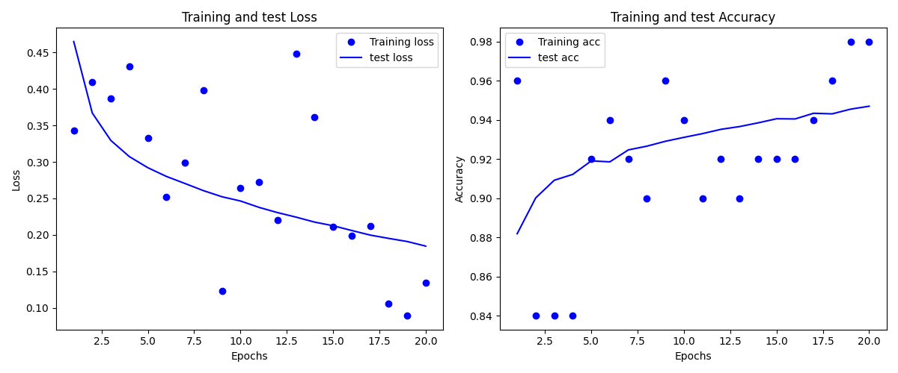

[](https://codecov.io/gh/TC-Zheng/NumpyML)
# NumpyML
Building a machine learning library that mimics PyTorch from scratch using only NumPy.

- [Introduction](#introduction)
- [Installation](#installation)
- [Testing on MNIST](#testing-on-mnist)

# Introduction
## Motivation
Drawing from my background in mathematics, this project is a synthesis of my mathematical knowledge and programming expertise. NumpyML aims to delve into the inner workings of neural networks, especially focusing on the backpropagation algorithm, providing an educational journey for both readers and myself.

## Features
* Tensor class mimicking PyTorch's tensors.
* Stochastic Gradient Descent (SGD) as an optimizer.
* A Sequential module with a Linear layer and a Tanh activation layer.
* Dataset and Dataloader classes to handle data.
* Multi-Layered Perceptron (MLP) as a starting architecture.
## Why NumPy
While it's feasible to create this library entirely in Python, leveraging NumPy offers the rapid linear algebra computations essential for efficient neural network training.

## Challenge faced
Building this library was a hands-on learning experience. While I had foundational knowledge about neural networks, implementing the backpropagation algorithm presented intricate details and challenges that deepened my understanding.

## Future Plans
* Implement a convolutional layer.
* Develop a recurrent neural network module.
* Integrate transformer-based architectures.

# Installation
To install NumpyML, follow these steps:

Clone the repository:
```
git clone https://github.com/TC-Zheng/NumpyML.git
```
Navigate to the repository's root directory:
```
cd NumpyML
```
Setup the environment
```
pip install -r requirements.txt
```
Install the package locally using pip:
```
pip install -e .
```
# Testing on MNIST

To validate the efficacy of NumpyML, it was benchmarked against the MNIST dataset - a foundational dataset for handwritten digit classification. You can find the test script in [examples/mnist.py](https://github.com/TC-Zheng/NumpyML/blob/main/examples/mnist.py)
. The chosen architecture was a Multi-Layered Perceptron with layers sized 784, 200, and 10 neurons. After training for 20 epochs, the model achieved an accuracy of 95%, suggesting that NumpyML's basic structures and algorithms are robust and capable.

Examining the figure below, it's evident that while my implementation may not exhibit the numerical stability of established libraries like PyTorch, the final outcomes align closely when using an identical architecture in both environments.

In the future, more complex datasets and tasks will be tackled to further test the library's versatility.


# Contributions
[MNIST Dataset](https://www.kaggle.com/datasets/hojjatk/mnist-dataset) The dataset and datareader used for MNIST example is downloaded from this site.

# Liscense
The content of this project is licensed under the [MIT License](LICENSE).
